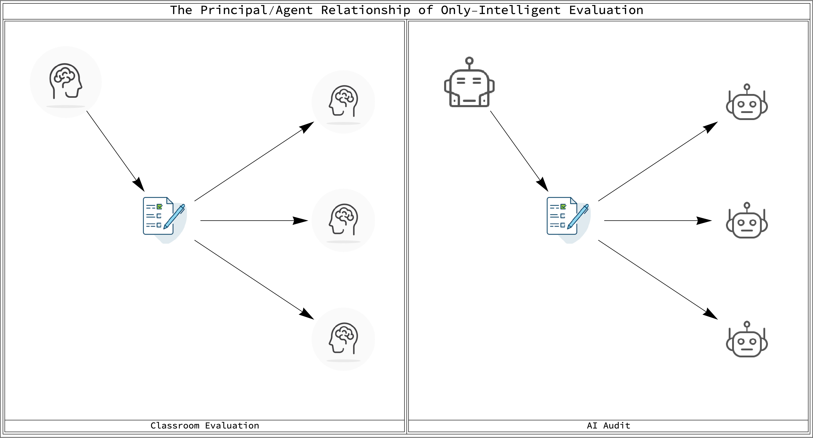
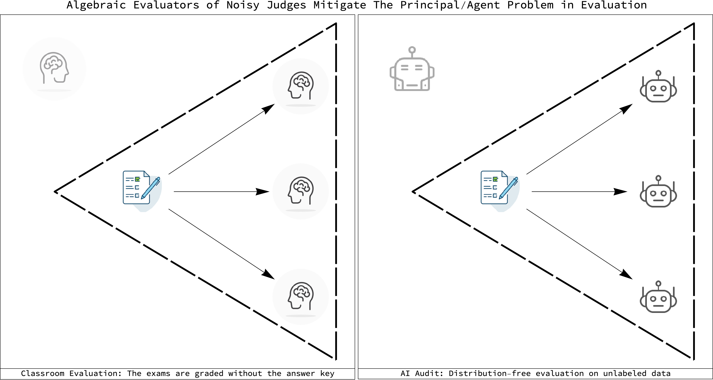

Thermometers for AI Auditing: Algebraic Evaluators of Noisy Judges on Unlabeled Data
====================================================================================

<figure>
    
    <figcaption>
    The assumption of "only intelligent evaluation"</figcaption>
</figure>

Who judges the judges? The problem of the authority of noisy judges when we
ourselves don't know their correct answers is pervasive in society and
technology. In AI it is exemplified by the Stanford HAI AI Audit Challenge. Our
submission to the challenge is this open source repository highlighting the
technology behind our GroundSeer(tm) products - a distribution-free approach to
noisy judges evaluation.

The submission focuses on one aspect of the AI Audit Challenge - the ubiquity of
black-box noisy AI algorithms. How can we know that these algorithms are working
correctly once deployed? How can we have any assurance of their correctness
without access to their internals so we can audit them? We need to be able to
monitor AI algorithms on the wild and we need to do so robustly. GroundSeer(tm)
points in one direction that can help us with this grand challenge. Its 2010
patent is the world's first distribution-free evaluator of noisy AI judges.

The safety engineer and the philosopher of science face the same "last mile
verification" problem. They must both evaluate noisy judges without the benefit
of the ground truth. GroundSeer(tm) is one way to mitigate this problem. The
main app in this submission is FindingErrorIndependentTrios.nb. It uses the same
core mathematical technology as GroundSeer(tm). We think it can be taken
further. Our submission is also a call to the curious inventors of the World to
explore these mathematical ideas and take them in new directions. Anyone in the
World curious about algebra and AI safety can explore with us.

All the code in this repository is written in Mathematica. This platform for the
Wolfram Language is perfect for our task. Mathematica neatly integrates the
data, programming, and algebraic aspects of evaluating noisy AI judges. Anybody
with access to a RaspberryPi can execute and experiment with this code. We hope
they do.

The core of that exploration is an initial app FindingErrorIndependentTrios.nb
that shows one of the many advantages of distribution-free evaluators. They can
alarm on their own failure. This makes them useful for AI safety. This use of
algebraic, not real numbers, gives them an important edge over evaluators that
use probability distributions. Using this app will help clarify the advantages
and limitations of doing this.

GroundSeer(tm) and these notebooks rely on the mathematics of Algebraic
Geometry. The explanation and demonstration of the core theorem used in this
repository is TheCoreTheorem.nb. The experiments in it explain how one can use
the voting frequencies of three noisy binary classifiers to evaluate them. They
can self-grade algebraically. Understanding the construction of the theorem can
be a springboard to other such algebraic evaluators.

To facilitate exploration by anyone, the FindingErrorIndependentTrios.nb app,
does not require that you fully understand the math behind it. You are given the
tool for evaluation and then asked to explore, empirically, various ways to use
it. These ideas are not exhaustive, they are suggestive. We hope you can take
them further.

## The role of distribution-free evaluators of noisy judges in AI safety and monitoring

<figure>
    
    <figcaption>
    Severing the master/slave relationship of "only intelligent evaluation"</figcaption>
</figure>

A central claim in our submission is that the AI community is almost exclusive
engaged with methods for AI safety that rely on probability distributions. We
expect that most, if not all, of the submissions to this AI Audit Challenge will
also be using the vast technology and understanding we have of probability
theory.

This is as it should be. These "doctors", whether human or other algorithms, are
needed and can help us go beyond what our submission does. Our contribution is
just a thermometer for noisy AI judges. We believe that a world where doctors
have thermometers is better than one where they don't. These are some of the
reasons we shoud be spending more effort on the evaluation side of AI and not
just on the learning side.

### 1. Robust to out-of-distribution shifts between training and deployment.

An immediate advantage of having algebraic evaluators is that the problem of
out-of-distribution shifts is side-stepped. No assumptions are made about
distributions so shifts in them are not directly relevant to their execution.
But this does not make algebraic evaluators immune to environmental shifts. They
are not robust to environmental changes that make the classifiers themselves
error correlated on the test sample. This raises an AI safety paradox. The
algebraic nature of the solution gives us a way to mitigate this safety failure.

### 2. Algebraic outputs can help alarm when evaluation assumptions are wrong.

The algebraic evaluator that forms the core of our submission is a deterministic
function that produces algebraic numbers. It has one big Achilles heel - it only
works correctly on binary classifiers that are error independent in the sample.
This "bug" is a safety "feature." The appearance of out of bounds or complex
numbers in the output of the evaluator would be an immediate signal that the
evaluator's independence assumptions are horribly wrong. This is useful.

### 3. Accessible even to highly motivated high school students.

The mathematics used in the AI thermometer in this submission comes from
Algebraic Geometry. A well known and respected textbook on the subject for
undergraduates was written by Cox, Little and O'Shea. It is now in its 4th
edition. It is not inconceivable that its theorems are within the reach of
highly motivated high school algebra students.

But understanding Algebraic Geometry is not a barrier to using and experimenting
with the AI thermometer. A quick perusal of the code and its small number of
code lines should convince the curious reader that they can quickly build their
own experimental uses.

Wolfram and Raspberry Pi extend further the possible audience of young
researchers and inventors that can play with these ideas.

## A Guide to the Repository

1. [TheCoreTheorem.nb](./TheCoreTheorem.nb) illustrates the core mathematical idea
of this submission - we can build systems of polynomial equations that relate
unknown evaluation statistics to observable moments of the decisions by the
classifiers on a test sample. in the case of error independent classifiers, the
resulting polynomial system is exactly solvable given three classifiers. We
illustrate this by doing a simulated evaluation.

2. [FindingErrorIndependentTrios.nb](./FindingErrorIndependentTrios.nb) is the
main experimental demonstration of our submission. Error independence can be
minimized by engineering classifiers. But how can we know that the independence
assumption applies in any given evaluation context? Algebraic evaluators solve
this perennial paradox of evaluation. The algebraic numbers they return can
alarm about the failure of the independence assumption itself. In this notebook
that idea is used in conjunction with another algebraic geometry idea - the
evaluation variety (the surface on which the true evaluation values must be)
can be constrained to an n-dimensional surface in a 2n+1 parameter space. This
allows us to scan for classifier trios that are most uncorrelated on unlabeled
data.

3. [MathematicaOnTheRaspberryPi.nb](./MathematicaOnTheRaspberryPi) provides
links necessary to install Mathematica on a Raspberry Pi. This greatly reduces
the barriers to using and exploring these computational ideas.

4. [AnEnablingTechnology.nb](./AnEnablingTechnology.nb) briefly outlines the many
ways that algebraic evaluators can be leveraged and their usefulness. Three
applications of algebraic evaluators are briefly discussed - AutoML, Fair AI,
and Error Correction.

5. [DifferentNotionsOfIndependence.md](./DifferentNotionsOfIndependence.md)
The idea of independence is widespread in science and mathematics. We have
linear independence, algebraic independence, etc. Most literature in AI uses
the notion of statistical distribution independence. Since algebraic evaluators
do not use probability distributions, they have a different definition of
independence. This document discusses the sample definition of error independence
used by algebraic evaluators. It contrasts it with the distribution independence
definition. In addition, it provides definitions for all the error correlations
needed to completely describe any ensemble of binary classifiers.

6.[EvaluatingSamplesIsNotLearningDistributions.md](./EvaluatingSamplesIsNotLearningDistributions.md)
points out the differences between the statistics of finite samples and the
statistics of infinite samples that are  most relevant to understanding the
strengths and limitations of algebraic  evaluators. It also illustrates how
evaluation theory is an alternative to learning theory. Much comtemporary
research tries to solve, on the learning side, problems that can also be solved
on the evaluation side.

7. [FurtherReading.nb](./FurtherReading.nb) gives a short, eclectic reading list
to books that touch on the broader aspects of this submission. Since the topic
of evaluation and authority touches many other facets of our societies, these
connections are inevitable. Here we highlight some of those connections in the
philosophy of science, pedagogy, and technological systems.
